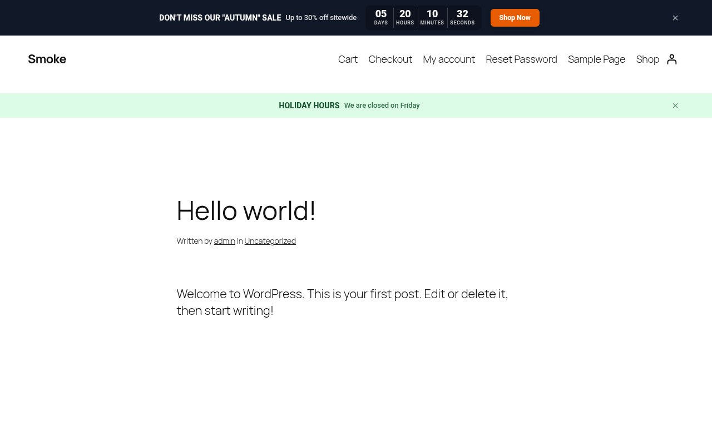
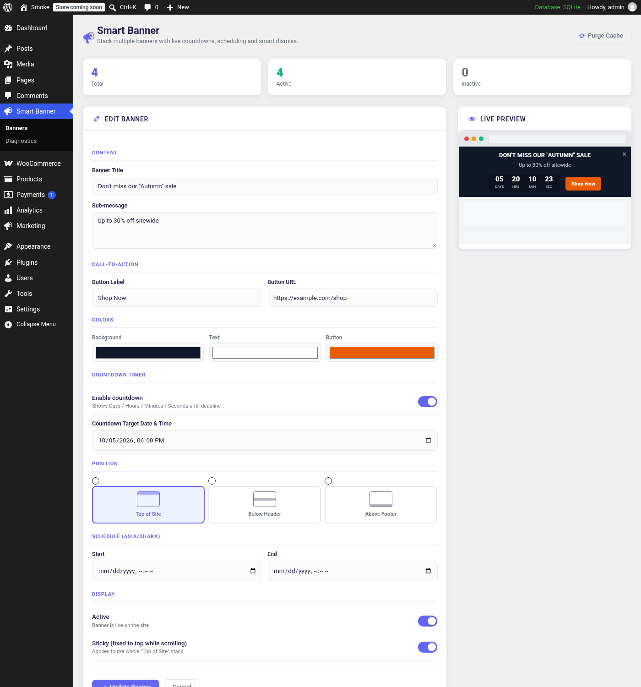
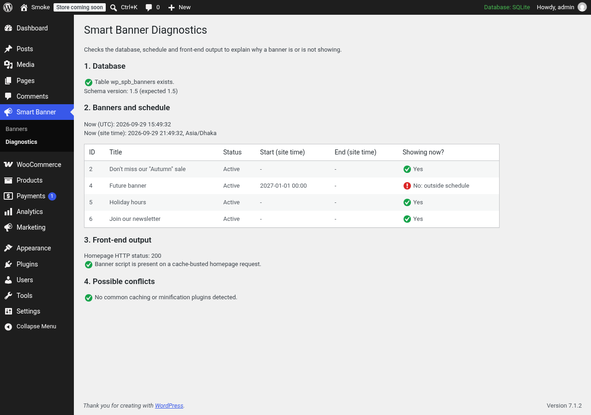

# Smart Banner

A WordPress plugin for stackable, site-wide announcement banners with scheduling, live countdowns, drag-to-reorder and remembered dismissals.




## Features

- **Multiple banners** stacked in three positions: top of site, below the header, and above the footer.
- **Scheduling** with start and end dates entered in the site timezone and stored in UTC.
- **Live countdown** (days, hours, minutes, seconds) to any deadline.
- **Call-to-action button** with its own color, plus background and text colors per banner.
- **Sticky mode** that pins the top stack while scrolling (and respects the admin bar).
- **Remembered dismissals**: closed banners stay hidden for 24 hours, even on cached pages.
- **Drag-to-reorder** banner list, pause / enable toggle and delete.
- **Live preview** in the editor as you type.
- **Automatic cache purge** after every change for WP Rocket, LiteSpeed Cache, W3 Total Cache, WP Super Cache, SiteGround Optimizer, WP Engine and the object cache, with a `spb_cache_purged` action for anything else.
- **Diagnostics screen** that explains why a banner is or is not showing (schedule, status, dismissals, front-end output, cache headers, conflicting plugins).
- **Theme agnostic**: banners are inserted into the DOM next to the theme's own `<header>` / `<footer>`, including block themes.
- **Translation ready** with a bundled `.pot` file.

## Screenshots

| Front end | Mobile |
|-----------|--------|
|  |  |

| Banner editor with live preview | Diagnostics |
|---------------------------------|-------------|
|  |  |

## Installation

1. Download the latest release zip (or clone this repository into `wp-content/plugins/`).
2. In WordPress admin, go to **Plugins > Add New > Upload Plugin** and upload the zip.
3. Activate **Smart Banner**. The `{prefix}spb_banners` table is created automatically.

```bash
cd wp-content/plugins
git clone https://github.com/lawrancebabu/smart-banner.git
```

## Usage

1. Go to **Smart Banner > Banners**.
2. Fill in the title, optional sub-message and button, pick colors and a position.
3. Optionally enable a countdown and set a start / end schedule (site timezone).
4. Click **Publish Banner**. Drag rows in the list to change the order.
5. If a banner does not appear, open **Smart Banner > Diagnostics**.

## How It Works

### Data

Banners live in a custom table, `{prefix}spb_banners`, created with `dbDelta()`. All queries use `$wpdb->prepare()` with the `%i` identifier placeholder (WordPress 6.2+). Dates are converted from the site timezone to UTC on save (`get_gmt_from_date()`) and compared with the current UTC time from PHP, so the schedule does not depend on the database server's timezone.

`spb_maybe_upgrade()` runs once per schema version on `admin_init`. It adds missing columns and repairs data saved by early versions (empty-string dates and dates stored in site time instead of UTC).

### Front end

On `wp_enqueue_scripts`, active banners are rendered in PHP (all fields escaped) and passed to `assets/js/frontend.js` with `wp_localize_script()`. The script inserts each group at the right place in the DOM, runs the countdowns and handles dismissals with a `spb_dismissed` cookie. Dismissed banners are filtered both on the server and in the browser, so full-page caches do not bring them back. Nothing is loaded when no banner is scheduled.

### Admin

State-changing actions (create, update, delete, toggle, reorder, purge) are handled on the screen's `load-*` hook before any output, with nonce and capability checks, and end with a redirect (Post/Redirect/Get). Admin CSS and JS load only on the plugin's own screens.

### Hooks used

| Hook | Type | Purpose |
|------|------|---------|
| `wp_enqueue_scripts` | action | Render active banners and enqueue front-end assets. |
| `admin_menu` | action | Banners and Diagnostics screens. |
| `load-toplevel_page_spb-banners` | action | Handle banner actions before output. |
| `admin_enqueue_scripts` | action | Admin assets on plugin screens only. |
| `admin_init` | action | One-time schema upgrade and data repair. |
| `init` | action | Load translations. |
| `register_activation_hook` | activation | Create the table. |
| `spb_cache_purged` | action (fired) | Extension point after caches are purged. |

### Security measures

- `ABSPATH` guard on every PHP file; `WP_UNINSTALL_PLUGIN` guard on `uninstall.php`.
- `manage_options` capability and nonces on every admin action.
- All SQL through `$wpdb->prepare()` or `$wpdb` insert / update / delete helpers with explicit formats.
- Input unslashed and sanitized per field (`sanitize_text_field`, `sanitize_textarea_field`, `esc_url_raw`, `sanitize_hex_color`, whitelisted position, validated datetime format).
- All output escaped (`esc_html`, `esc_attr`, `esc_url`, `wp_kses`).
- No debug output on the front end.
- Code checked with PHP_CodeSniffer using WordPress Coding Standards and PHPCompatibilityWP (`phpcs.xml.dist`).

## Upgrading from WP Smart Banner 2.1

Deactivate and delete the old plugin first (it has no uninstall routine, so the banners table is kept), then activate Smart Banner. Both versions use the same function names, so they cannot be active at the same time. Re-save any banner whose text already shows backslashes from the old version.

## Uninstall

Deleting the plugin drops the `{prefix}spb_banners` table and removes the `spb_db_version` option.

## Development

```bash
composer global require wp-coding-standards/wpcs phpcompatibility/phpcompatibility-wp
phpcs            # uses phpcs.xml.dist
wp i18n make-pot . languages/smart-banner.pot --exclude=screenshots
```

## Requirements

- WordPress 6.2 or later
- PHP 7.4 or later
- MySQL / MariaDB (standard WordPress database)

## File Structure

```
smart-banner/
├── smart-banner.php          # Bootstrap: constants, includes, activation, admin assets
├── uninstall.php             # Drops the table and options on uninstall
├── includes/
│   ├── database.php          # Schema, upgrades, data access, timezone helpers
│   ├── frontend.php          # Banner rendering and front-end assets
│   └── cache.php             # Cache purge integrations
├── admin/
│   ├── admin-menu.php        # Menu, request handling, input sanitization
│   ├── banners-page.php      # Banner editor, live preview and list
│   └── debug-page.php        # Diagnostics screen
├── assets/
│   ├── css/frontend.css
│   ├── css/admin.css
│   ├── js/frontend.js        # DOM insertion, countdowns, dismissals
│   └── js/admin.js           # Live preview, drag-to-reorder, unsaved changes guard
├── languages/smart-banner.pot
├── screenshots/
├── phpcs.xml.dist
├── readme.txt
├── README.md
├── LICENSE
└── .gitignore
```

## License

GPL-2.0-or-later. See [LICENSE](LICENSE).

## Author

**Lawrance Babu Gain**, Senior PHP / WordPress / Laravel Developer

- GitHub: [@lawrancebabu](https://github.com/lawrancebabu)
- Website: [topshelfpeptide.com](https://topshelfpeptide.com)
- Email: [lawrance1020@gmail.com](mailto:lawrance1020@gmail.com)
